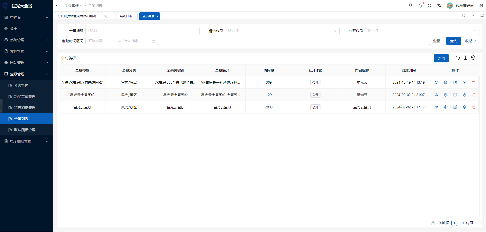
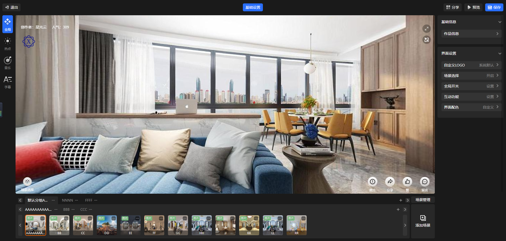
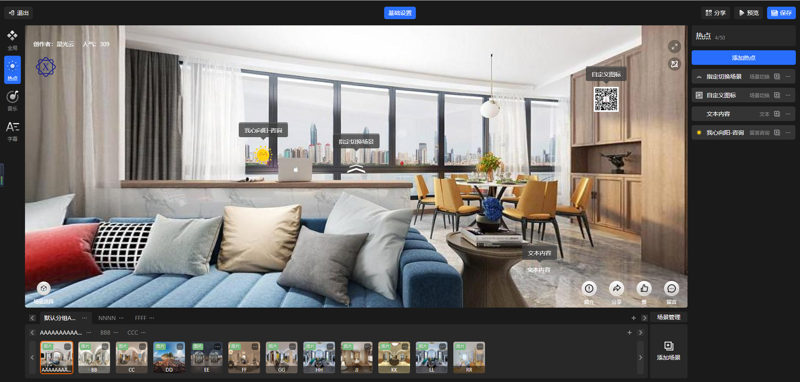
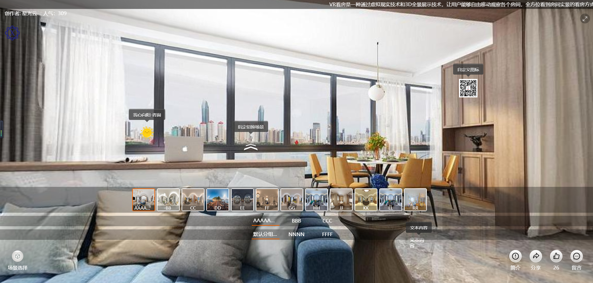

# 星光云全景
# 更多详细介绍请前往CSDN查看
# [星光云全景详细介绍](https://blog.csdn.net/qq_34523482/article/details/140058675)
# 体验账号密码
## https://vr.ailemon.cc/manager
## 账号：18175760278  密码：12345678

## 作者微信

#### 介绍
星光云720全景VR系统源码

# moon-starters

## 项目介绍

`moon-starters`是Moon脚手架及其业务模块的基础支撑构件，可以快速引入其他中间件和基础配置

## JDK版本 
JDK compatibility: 17 - 21

## 后端主要依赖
| 组件 | 
|:---|
| Spring Boot 3.2.3 | 
| Spring Cloud Alibaba 2023.0.0.0-RC1 | 
| Web 容器: Undertow (embedded) | 
| 安全框架&会话管理: SA-Token | 
| 持久层框架: Mybatis-Plus | 
| 数据库连接池: HikariCP | 
| 缓存中间件: Redis | 
| Redis分布式业务锁框架: Redisson | 
| RPC框架: Dubbo | 
| 分布式事务框架: Seata | 
| 常用工具集: Hutool-all | 
| API文档: Knife4j | 
| 日志框架: Slf4j + Logback | 

## 前端框架
| 框架                              | 
|:--------------------------------|
| 基于Vue Vben Admin 改造适配的前端框架，开箱即用 | 

## 前端node 版本
| 版本                              | 
|:--------------------------------|
| node版本 >=18.12.0 | 
| pnpm >=8.10.0 | 

# 部分系统图

